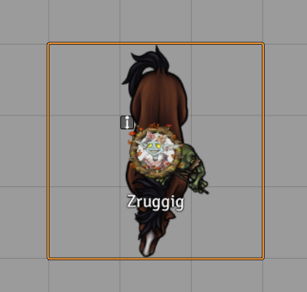
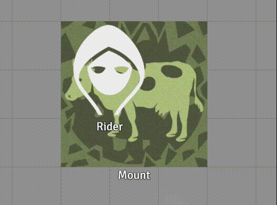

# Mount Up!

 

[](https://forge-vtt.com/bazaar#package=foundryvtt-mountup) 


[](https://www.foundryvtt-hub.com/package/foundryvtt-mountup/)


**Mount Up!** is a module for [Foundry VTT](https://foundryvtt.com/  "Foundry VTT") that allows tokens to carry or be carried by other tokens. This is completely system agnostic, and fully customizable to fit right into your game.

## NOTE: If you are a javascript developer and not a typescript developer, you can just use the javascript files under the dist folder

# Installation
It's always better and easier to install modules through in in app browser. Just search for "Mount Up!"

To install this module manually:
1. Inside the Foundry "Configuration and Setup" screen, click "Add-on Modules"
2. Click "Install Module"
3. In the "Manifest URL" field, paste the following url:
`https://raw.githubusercontent.com/p4535992/MountUp/master/src/module.json`
4. Click 'Install' and wait for installation to complete
5. Don't forget to enable the module in game using the "Manage Module" button

### libWrapper

This module uses the [libWrapper](https://github.com/ruipin/fvtt-lib-wrapper) library for wrapping core methods. It is a hard dependency and it is recommended for the best experience and compatibility with other modules.

### token-attacher

This module uses the [token-attacher](https://github.com/KayelGee/token-attacher) library like a dependency. It is a hard dependency and it is recommended for the best experience and compatibility with other modules.

### token-z

This module uses the [token-z](https://github.com/theripper93/token-z) library like a dependency. It is a hard dependency and it is recommended for the best experience and compatibility with other modules.

## Known Issue\Limitation

- The multi rider functionality on the same mount work partially, but it should be enough for most use cases...

## Settings

- **Icon:** The icon to show in the HUD
- **HUD Column:** Which HUD column to place the button in
- **HUD Top/Bottom:** Where to place the button in the column
- **Should riders be locked to mounts?:** _[No need anymore]_ If enabled, riders will be unable to move separately from their mount until dismounted. NOTE: with the new 'can Move Constrained' from Token Attacher you don't need to touch this anymore, but i leave if anyone find useful for set a initial position of the rider on the mount.
- **Should riders rotate with mounts?:** _[No need anymore]_ If enabled, rider rotation will be updated to match mount rotation. NOTE: with the new 'can Move Constrained' from Token Attacher you don't need to touch this anymore, but i leave if anyone find useful for set a initial position of the rider on the mount."
- **Rider Horizontal Alignment:** _[No need anymore]_ By default is center. NOTE: with the new 'can Move Constrained' from Token Attacher you don't need to touch this anymore, but i leave if anyone find useful for set a initial position of the rider on the mount.
- **Rider Vertical Alignment:** _[No need anymore]_ By default is center. NOTE: with the new 'can Move Constrained' from Token Attacher you don't need to touch this anymore, but i leave if anyone find useful for set a initial position of the rider on the mount.
- **Send messages to chat:** Should chat messages about mounting/carrying and dismounting/dropping be sent to chat?
- **Mount Message Format:** How mounting chat messages should be formatted if enabled. (use {rider} and {mount} for name substitution)
- **Dismount Message Format:** How dismounting chat messages should be formatted if enabled. (use {rider} and {mount} for name substitution)
- **Rider Position:** _[No need anymore]_ Set the position for the rider by default is center. NOTE: with the new 'can Move Constrained' from Token Attacher you don't need to touch this anymore, but i leave if anyone find useful for set a initial position of the rider on the mount.
- **Enable active token mount up management:** Every time you mount up or dismount on the mount token and/or rider token some active effect can be added or removed based on the changes configuration on both rider and mount
- **Enable auto update elevation:** If enabled thi setting will make sure to always sync the riders elevation with the mount elevation
- **Enable 'can move constrained':** Enable the the new 'Can Move Constrained' feature from Token Attacher


## Usage

### Mounting

To mount a token:
1. Select the "rider" and the "mount" tokens.
2. Right click on the "mount" icon to bring up the token HUD.
3. Click on the horse icon (you can change this in your game).\
\
*The rider will now be linked to the mount. Anywhere the mount moves, the rider follows.*

### Dismounting

To dismount a token from a token:
1. Right click on the "mount" to bring up the token HUD.
2. Click on the dismount icon.\
\
*The rider will now be un-linked from the mount, and is free to move on their own.*

### Partial multi mounting is supported



### Can Move Constrained

Kneel before the genius of [KayelGee](https://github.com/KayelGee/) author of [Token Attacher](https://github.com/KayelGee/token-attacher) and thank discord for this amazing feature.



### Auto Elevation [EXPERIMENTAL]

If enabled thi setting will make sure to always sync the riders elevation with the mount elevation, it can be useful for scene with the levels module


### Flying away !!!!

Now when you mount some flying mount with the active effect `ATMU.flying = true` a beauty shadow effect is applied with the module [Token Magic](https://github.com/Feu-Secret/Tokenmagic).


**NOTE:** You must enable the active effect management for this to work.

### Active Effect of Mount Up and Dismount up

Every time you mount up or dismount on the mount token and/or rider token some active effect can be added or removed based on the changes configuration on both rider and mount


#### How the active effect name is checked on the module ?

You can use any active effect where the name is founded from the following code of the module:

```
const effectNameToCheck = <EFFECT NAME>;
// For each active effects on the token/actor
let result = false;
for(const effect of effects){
    // regex expression to match all non-alphanumeric characters in string
    const regex = /[^A-Za-z0-9]/g;
    // use replace() method to match and remove all the non-alphanumeric characters
    result  = effectNameToCheck.replace(regex, "").toLowerCase().startsWith(effectIdOfTheModule.replace(regex, "").toLowerCase());
    if(result)break;
}
return result;
```

#### What active effect data changes are used from this module ?

Every active effect data of this is module use any changes with the prefix `ATMU` acronym for _Active Token Mount Up_ .

There three type of these AE used and supported from this module:

| Key Syntax                      | Type    | Description                         | Examples Active Effect Data [Key = value] |
| :------------------------------:|:-------:|:-----------------------------------:|:--------:|
| `ATMU.toMountOnMount`   | boolean  | Transfer this active effect from the rider to the mount when "Mount Up"   | `ATMU.toMountOnMount = true`, `ATMU.toMountOnMount = false` |
| `ATMU.toMountOnDismount`| boolean  | Transfer this active effect from the rider to the mount when "Dismount Up" | `ATMU.toMountOnDismount = true`, `ATMU.toMountOnDismount = false` |
| `ATMU.toRiderOnMount`   | boolean  | Transfer this active effect from the mount to the rider when "Mount Up"   | `ATMU.toRiderOnMount = true`, `ATMU.toRiderOnMount = false` |
| `ATMU.toRiderOnDismount`| boolean  | Transfer this active effect from the mount to the rider when "Dismount Up" | `ATMU.toRiderOnDismount = true`, `ATMU.toRiderOnDismount = false` |
| `ATMU.flying`           | boolean  | Check is the mount is a flying one. If tru we apply the token magic effect "flying" | `ATMU.flying = true`, `ATMU.flying = false` |

For now no automatic UI is prepared (and don't think we need one) just created  a active effect and add this changes on it.

**NOTE:** by default all _effect_ from this module are _temporary_, but you can customize like you want.


## API

Some functionality is exposed to macros for repeatable usage. All macros will either accept a token ID or name (case insensitive).

**NOTE:** It's advisable to use the `game.modules.get('foundryvtt-mountup').api.` insrtead `MountUp.` for best practices

#### Macro to Mounting

You can mount a rider to a mount using the following syntax:

`MountUp.mount('RiderNameOrId', 'MountNameOrId')`

or you can use the module 'token-attacher'

#### Macro to Dismounting

You can have a rider dismount by passing it's token name or id:

`MountUp.dismount('RiderNameOrId)`

or you can use the module 'token-attacher'

#### Macro to Drop a rider from a mount

You can have a mount drop its rider by passing the mount's name or id:

`MountUp.dropRider('MountNameOrId')`

#### Macro function to toggle a rider mount pair

You can have a mount drop its rider by passing the mount's name or id:

`MountUp.toggleMount('RiderNameOrId', 'MountNameOrId')`


#### Macro to clean up flags on token and actor

`game.modules.get('foundryvtt-mountup').api.cleanUpTokenSelected()`

# Build

## Install all packages

```bash
npm install
```
## npm build scripts

### build

will build the code and copy all necessary assets into the dist folder and make a symlink to install the result into your foundry data; create a
`foundryconfig.json` file with your Foundry Data path.

```json
{
  "dataPath": "~/.local/share/FoundryVTT/"
}
```

`build` will build and set up a symlink between `dist` and your `dataPath`.

```bash
npm run-script build
```

### NOTE:

You don't need to build the `foundryconfig.json` file you can just copy the content of the `dist` folder on the module folder under `modules` of Foundry

### build:watch

`build:watch` will build and watch for changes, rebuilding automatically.

```bash
npm run-script build:watch
```

### clean

`clean` will remove all contents in the dist folder (but keeps the link from build:install).

```bash
npm run-script clean
```
### lint and lintfix

`lint` launch the eslint process based on the configuration [here](./.eslintrc)

```bash
npm run-script lint
```

`lintfix` launch the eslint process with the fix argument

```bash
npm run-script lintfix
```

### prettier-format

`prettier-format` launch the prettier plugin based on the configuration [here](./.prettierrc)

```bash
npm run-script prettier-format
```

### package

`package` generates a zip file containing the contents of the dist folder generated previously with the `build` command. Useful for those who want to manually load the module or want to create their own release

```bash
npm run-script package
```

## [Changelog](./changelog.md)

## Issues

Any issues, bugs, or feature requests are always welcome to be reported directly to the [Issue Tracker](https://github.com/p4535992/MountUp/issues ), or using the [Bug Reporter Module](https://foundryvtt.com/packages/bug-reporter/).

## License

- **[Condition Management](https://github.com/kandashi/condition-automation)** : [???](https://github.com/kandashi/condition-automation/blob/master/LICENSE)

This package is under an [MIT license](LICENSE) and the [Foundry Virtual Tabletop Limited License Agreement for module development](https://foundryvtt.com/article/license/).


## Credit

- A little part of code is inspired from [kandashi](https://github.com/kandashi/) and the module [Condition Management](https://github.com/kandashi/condition-automation)

## Acknowledgements

Bootstrapped with League of Extraordinary FoundryVTT Developers  [foundry-vtt-types](https://github.com/League-of-Foundry-Developers/foundry-vtt-types).

Mad props to the 'League of Extraordinary FoundryVTT Developers' community which helped me figure out a lot.
